# lec16 

## Introduction to Network
As a component and as a system itself

### 网络分层

- 网络分层


- 封装
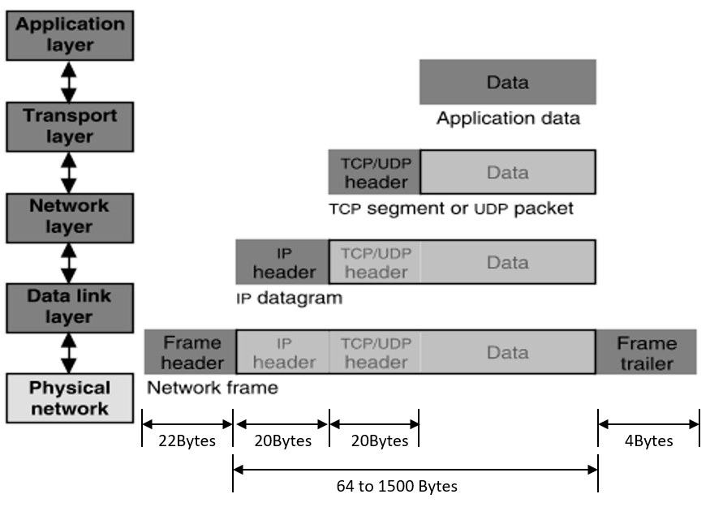

- 应用层（Application Layer）(**data**)
    - Entities
        - Client & Server
        - End-to-end connection
    - Namespace：URL
    - 协议
        - HTTP、FTP、SMTP 
    - 关注点在于传输的数据
- 传输层（Transport Layer）(**TCP：segment** **UDP: datagram**)
    
    - Entities
        - Sender & Receiver
        - 代理、防火墙等
        - End-to-end connection
    - Namespace：端口号
    - 协议
        - TCP、UDP
    - 关注点
        - TCP： 若丢包则重传
        - UDP： Nothing
- 网络层(Network Layer / IP Layer) (**packet**)
    
    - Network Entities
        - 网关、网桥
        - 路由器
    - Namespace
        - IP 地址
    - 协议
        - IP ICMP
    - 整个网络视作一个图，网络层关注的是下一个节点哪个（由路由表决定）
- 链路层(Link Layer(& Physical Layer)) (**frame**(&**bit**))
    
    - Network Entities
        - 集线器、交换机
        - 各种网线
    - Namespace
        - 不需要
    - 协议
        - Ethernet ATM
        - ARP RARP
    - 关注物理传输与错误比特的检测

## 链路层 （The Link Layer）

- 目的： 将数据从一个物理位置传输到另一个物理位置

### 同步传输： 使用共享时钟（shared clock）进行物理传输

- Example： 将同一个芯片上的寄存器1的bit 传输给寄存器2
    - 用一根线将寄存器1的输出接到寄存器2的输入
    - 等待寄存器1的输出完毕，信号传给寄存器2 (propagation)
    - 寄存器2在下一次 clock tick 读取输出
    - **前提假设**：propagation 能在一个 clock 中做完

### 不使用共享时钟
- Three-wire ready/acknowledge protocol
    - 1. A 将数据放置在 data line 上
    - 2. A 改变 ready line 上的值
    - 3. B 发现 ready line 的值改变，然后就读取 data line 的数据，并且改变 acknowledge line 的值

    

### Parallel Transmission （并行？传输）
- 按照之前的方式，如果传输时间 Δt (propagation time)，那么每次传输 1 bit 需要多于 2Δt 的时间，最大数据传输率(data rate)为 1/(2Δt)

- Parallel Transmission
    - 用 N 根并行的 data line 那么传输率就能达到 N/(2Δt)

- Example：SCSI，打印机

### Serial Transmission （序列化传输）
- Ready/acknowledge protocol 这种方式 Δt 增长的很快，会极大程度上限制数据传输率
- Serial Transmission
    - 一根线中发送 a stream of bits
    - 并不等待 receiver 的回复
    - 期望 receiver 自己恢复这些 bits
    - Higher rates, longer distance, fewer wires
    - Example: USB, SATA

### 信号传输的模拟信号


- B 并不知道 A 的 clock 是什么样的，因此不知道该如何采样。如上图所示。

- Voltage Controlled Oscillator
    - 这种硬件本质上是作为 receiver 的 clock source。原理略。
- 问题：在 stream 中如果没有数据传输（e.g.  全是 0），VCO 的 phase-locked loop 将会无法同步。

### 曼彻斯特编码 （Manchester Code）
为了解决传输中全零导致的问题，将每个byte编码，保证传输。

- 0 => 01, 1 => 10
- 最大数据传输率减半，但是这种方法简单有效

### 如何共享连接？
- 同步通信（Telephone communication）
    - 需要交换机先行安排（prior arrangement）
    - 连接：set up & tear down
    - 流式传输（Stream）：continuous bits flows out of a phone
- 异步通信（Asynchronous communication）
    - 消息机制（Message）：突发性的，ill-suited to fixed size and spacing of isochronous frames
    - 无长连接 （Connectionless）

### 同步多路复用（Isochronous Multiplexing）


- 电话网络 Telephone Network
    - Leverage "virtual link" for connection （？）
    - 当交换机中没有空闲的位置时，将会进入网络繁忙状态
- 时分多路复用 Time Division Multiplexing (TDM)
    
    - 时间片a给第一个人用，时间片b给第二个人用，……
    - Q：为什么电话声音仍然是连续的？
    - A：时间片分隔足够小

### 数据传输网络 （Data Communication Network）

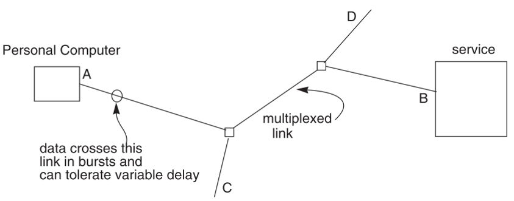

### Frame and Packet: Asynchronous Link （链路层和网络层，异步链路）

- Frame 可以是任意长度，只要链路是空闲的，可以随时被传输
- Packet 是带有 guidance info 的 variable-length 的 frame
- 无长连接（Connectionless transmission）：不需要维护状态
- Segment and reassemble
- Packet voice: replacing many parts of isochronous network


### Multiplexing / Demultiplexing


- 多路复用要维护一个队列，交换机需要内存/缓存
- 解复用需要用到 packet header 里的信息
    - Header 包括目的地
    - 交换机里有一个 forwarding table，根据这个表选择经由哪个链路到目的地

### Framing Frames

没看懂这页ppt讲啥，问了CS的，他们计算机网络也没讲这么细

### 错误处理（Error Handling）
- 错误检测的代码
    - 冗余数据
    - Example：checksum
- 检测到错误以后做什么？
    - 错误纠正：需要足够的额外数据（redundancy）
        - 噪声需要被充分理解（比如磁盘）
    - 要求发送者重传：发送者在 buffer 里还有 frame
    - 接收者放弃数据
    - 综合以上所有方法

### 实现：更多的冗余信息（Incremental Redundancy）

- 前向传播错误纠正
    - 存储、传输之前，首先进行编码（encoding）
    - 之后由接收者自行解码（decoding）
- 海明距离（Hamming Distance）
    - 定义：A 异或 B 的结果中 1 的个数，即为 A 与 B 的海明距离

- Example 1： Simple Parity Check
    - 2 bits -> 3 bits
        - 发现 1-bit 的错误
        - 8 patterns total
        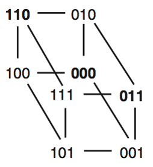

    - 只有 4 个正确的 patterns
        - 00 -> 000
        - 11 -> 110
        - 10 -> 101
        - 01 -> 011
    - 海明距离为 2
        - 1 个比特反转会导致错误的模式
- Example 2： 4->bit -> 7->bit
    - 编码规则：4 bits -> 7 bits
        - 3 extra bits 可以区分 8 种情况
        - e.g. [1101] -> 10 [1] 0 [101]
        -  4 bits 中的第一位位于 7 bits 的第三位；4 bits 中的第二到四位位于 7 bits 的第五到七位。（方括号中为原始信息）
        - 额外的 3 个 bit 由下图得出
        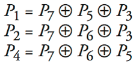
    - 如何纠正 1-bit error
        - 检测策略如下表所示
        
        - e.g. 如果 P3 错了，计算 P1，P2，P4 发现其中 P1 & P2 不匹配，那么可以确定是 P3 错了。再由 P1 ⊕ P7 ⊕ P5 即可还原 P3 

# lec 17

## Network Layer
All about routing


### IP：Best-effort Network
- 尽力服务模式 (Best-effort network)
    - 网络发生拥塞时，不顾及用户，直接丢弃数据包，直至流量减少
- 保证传输模式 (Guaranteed-delivery network)?
    - 也称 store-and-forward network，不丢包
    - 面向完整的信息而不是数据包 (packets)
    - 使用磁盘作缓存，来处理高峰流量
    - 跟踪每条消息，保证没有一条丢失
- 现实世界中
    - 没有绝对的 guarantee
    - High layer: Guaranteed-delivery
    - Lower layer: Best-effort

### Forwarding Table：Routing

- 不可能人工建立 Forwarding Table
    - 决定最短路径需要计算
    - 链路改变时需要重新计算 Forwarding Table
    - 链路传输失败时需要重新计算 Forwarding Table
    - 需要根据网络拥塞情况调整
- Stating routing vs adaptive routing
    - Adaptive routing 需要一些信息的交换

### Control-plane VS Data-place
- Control-plane - Learning what we will do
    - 通过定义规则，来控制数据流
    - e.g. 路由算法
- Data-plane - Actualy moving the packets based on what we learned.
    - The data-path which copies data according to the rules
    - 性能很关键
    - e.g. IP 前向传播过程
- 路由表
    - Control-plane 写这个表
    - Data-plane 读这个表

## Routing

### 路由协议的目的
- 1. 使每个交换机都知道如何到达网络中任意一个节点 dst
- 2. 使每个交换机都知道，到达 dst 的最短路径
- 3. 在每个交换机中建立路由表，比如 routing-table[dst] 返回到 dst 的最短路径

### 分布式路由：三步骤
- 节点通过 HELLO protocol 知道他们的邻居
- 节点通过广播(advertisements)知道其他所有能够到达的节点
- 节点决定最短路由

### 两种路由协议
- Protocol 1： Link-state
    - 节点 A 向所有节点广播 A 到 A 的邻居的 cost
        - via flooding
    - 结合使用 Dijkstra's
- Protocal 2： Distance-vector
    - 节点 A 向 A 的邻居广播 A 到所有它已知节点的 cost
    - 通过 Bellman-Ford 更新路由表

### Link-state Routing

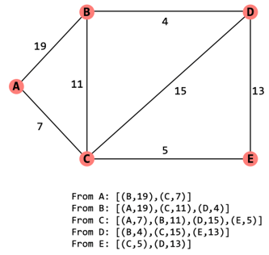

- Example: 顶点A的更新过程
    

### Distance-vector Routing


### Problem: Do not scale to the Internet
- Link-State
    - Pro: 建表很快 (Fast convergence(n. 会聚))
    - Cons: High overhead because of flooding
    - 适用于 SJTU 规模的网络，而不适用于 Internet
- Distance Vector
    - Pro：Low overhead
    - Cons：建表很慢，与最长的路由成正相关 (Convergence time is proportional to the longest path)
    - 适用于小型网络

### 3 ways to scale

- Path-vector Routing
    - 广播中同时包含路径，以检测 loops
- Hierarchy of Routing
    - Route between regions and then within a region
- Topological Addressing （设置地址）
    - 为连续的 block 赋予地址，使 advertisement 更小

### Path Vector Exchange
- 每个节点维护一个 path vector
    - 它是到某个目的地的完整路径
    - 逐渐知道其他的路径
    - 从其他新的 path vector 建立一个新的 forwarding table
- 算法
    - Advertising
    - Path selection

- Example


下图的 path-vector & forwarding table 都是节点 G 的


- Better for scaling
    - 类似于 Distance-Vector 但是在广播信息中包含了完整的路由
    - Overhead 更多（advertisement 变大），但是 convergence time 减少（避免了无穷大的最糟糕情况）
    - Overhead 比 Link-State 更低

### Q&A of Path-Vector
- 如何避免 loops
    - 当节点更新 path 时，不会选择含有它自己的 path
- 一个节点接收到同一个目的地多条不同的路径时会怎么做？
    - 取最短
- 图改变了会怎么样？
    - 新的节点加入仍照常计算。
    - 如果某节点从图中删去（该节点停止广播），那么它的邻居就会丢弃跟他有关的路径

### Hierarchy Address Assignment & Routing
- Path Vector 实现的两个问题
    - 每个 attachment point 必须有一个唯一的地址
    - 随着节点 (attachment points) 数量增多，path vector 也会变大
- Region 也可以称为 Autonomous System


- 但是引入了新的问题：复杂性
    - 需要将 address 与 location 绑定
    - Paths 可能不再是最短
        - 由于 hierarchy 导致少了一些节点之间的信息
- More about hierarchy
    - 可以拓展至更多的 levels
    - 不同地方各自由不同的 levels

### Routing Hierachy
- 跨地区 （Across Region）
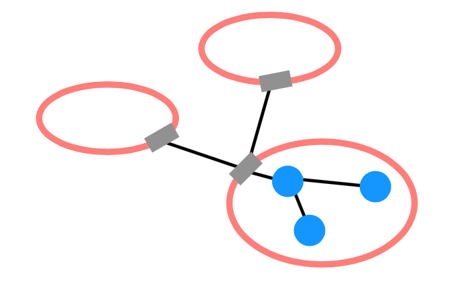
    - 使用一个路由协议来做跨地区的路由，地区中采用另一个协议
    - 在地区边缘的设备需要能够 "translate" or "speak" botn protocols
- BGP: path-vector protocol used across region
    - Border Gateway Protocol

### Topological Addressing
- 减小路由表规模
    - 虽然有了 Hierarchy，但是 BGP 仍然是对 IP 地址计算路由 （e.g. to 19.0.0.1 but not to region-3)
    - 每个区域内的 IP 地址都是连续的，因此他们可以通过特定的表示方式表示。e.g. CIDR
    - 使 advertisements 更小

## Data Plane：Packet Forwarding

### 网络层接口
```C
structure packet{
    bit_string source
    bit_string destination
    bit_string end_protocol
    bit_string payload
}
```
```C
procedure NETWORK_SEND (segment_buffer, destination, net_protocol, end_protocol)
    packet instance outgoing_packet
    outgoing_packet.payload ← segment_buffer 
    outgoing_packet.end_protocol ← end_protocol 
    outgoing_packet.source ← MY_NETWORK_ADDRESS 
    outgoing_packet.destination ← destination 
    NETWORK_HANDLE (outgoing_packet, net_protocol)

procedure NETWORK_HANDLE (net_packet, net_protocol) 
    packet instance net_packet 
    if net_packet.destination != MY_NETWORK_ADDRESS then
    next_hop ← LOOKUP (net_packet.destination, forwarding_table)
    LINK_SEND (net_packet, next_hop, link_protocol, net_protocol)
    else
    GIVE_TO_END_LAYER (net_packet.payload, 
    net_packet.end_protocol, net_packet.source)
```

### 前向传播 IP packet
- 在 Forwarding Table 中查找数据包的目的地（DST）
    - 若找到，则找到对应的链路（link）
    - 否则 drop packet
- Decrement TTL(Time To Live)
    - 当 TTL 为零时，drop packet
    - 防止网络中出现无限循环的 packet
- 更新 header 的 checksum
- 将 packet 发送至对应端口 （物理端口，而非我们通常所说所说的 TCP/IP 协议中的逻辑端口）
- 将 packet 传输至链路

### Data-plane Case Study: Intel's DPDK
- DPDK: Data Plane Development Kit


- 网卡
    - 有一些物理端口
    - 每个物理端口都有有 RX / TX （输入输出口）
- 处理器
    - 从 RX 读数据包  
        - 轮询(polling)
    - 找到输出端口
    - 将数据包写至 TX

## NAT (Network Address Translation)
- 私网
    - Public routes don't accept routes to network 10
- NAT router: 桥接私网
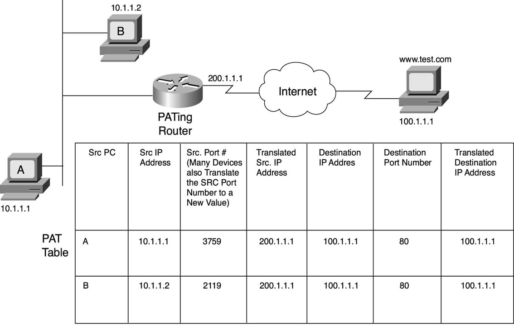
    - 本质上是公网与私网之间的路由器
    - 发送: 将源地址(source address)修改为临时的公网地址(public address)
    - 接受: 同理，查找 mapping table 做类似修改
- 限制
    - 一些端到端的协议会把地址放在原始数据(payload)中
    - NAT route 可能成为性能瓶颈
    - 如果两个私网合并该怎么办？
- Example


## Case: Ethernet Mapping

### Mapping Internet to Ethernet
- Listen-before-sending rule, collision
- Ethernet: CSMA/CD
    - 当 A、B 两站同时检测到信道空闲时，会同时传输数据，但是就会发生冲突。
    - 为了解决该问题而提出该协议
    -  发送数据前 先侦听信道是否空闲 ,若空闲，则立即发送数据。若信道忙碌，则等待一段时间至信道中的信息传输结束后再发送数据；若在上一段信息发送结束后，同时有两个或两个以上的节点都提出发送请求，则判定为冲突。若侦听到冲突,则立即停止发送数据，等待一段随机时间,再重新尝试。

### Overview of Ethernet
- A half duplex(adj. 两部分的) Ethernet
    - The max propagation time is less than the 576 bit times, the shortest allowable packet （？）
    - 两个发送者能同时检测到冲突
    - 如果冲突，等待随机时间
- A full duplex Ethernet & point-to-point Ethernet
    - No collisioins
    - the max length of the link is determined by the physical medium


### 交换机与集线器的区别
- 集线器
    - 每个 frame 被广播(broadcast)到它所有物理端口上
    - 一个 10/100Mbps 的集线器，每个端口共享总带宽
- 交换机
    - 记录每个设备的 MAC 地址
    - 一个 10/100Mbps 的交换就，为每个端口分配 full 10/100Mbps

### Broadcast Aspects of Ethernet
- Broadcast Network (集线器)

    - 每个 frame 都会被发送至每个 station
    - **ETHERNET_SEND**
        - Pass the call along to the link layer
    - **ETHERNET_HANDLE**
        - 十分简单，甚至可以在硬件中来实现

```C
// No need to do any forwarding
procedure ETHERNET_HANDLE (net_packet, length)
    destination ← net_packet.target_id
    if (destination == my_station_id or destination == BROADCAST_ID ) 
        GIVE_TO_END_LAYER (net_packet.data, 
                        net_packet.end_protocol, 
                        net_packet.source_id)
    else
        ignore packet
```

### Layer Mapping: Attach Ethernet to Forwarding Network

- L 给 server N 发 RPC 请求，直接通过 link 1 给 station 18 发数据包即可
- 但是如果 L 要给 E 发 RPC 请求

### Layer Mapping
- The Internet network layer
    - **NETWORK_SEND**(data, length, RPC, INTERNET, N)
    - **NETWORK_SEND**(data, length, RPC, ENET, 18)
- L 必须维护一个表
    - 访问 E 必须要经过 enet/19 的 K


### ARP (Address Resolution Protocol)
- **NETWORK_SEND**("where is M?", 11, ARP, ENET, BROADCAST)
- **NETWORK_SEND**("M is at station 15", 18, ARP, ENET, BROADCAST)
- L 如果询问 E 的以太网地址，但是 E 在 Internet 中，接收不到 Ethernet 内部的广播，但是位于 station 19 的 router K 可以接收到，K 会回复一个 ARP response
- Manage forwarding table as a cache

### ARP & RARP Protocol
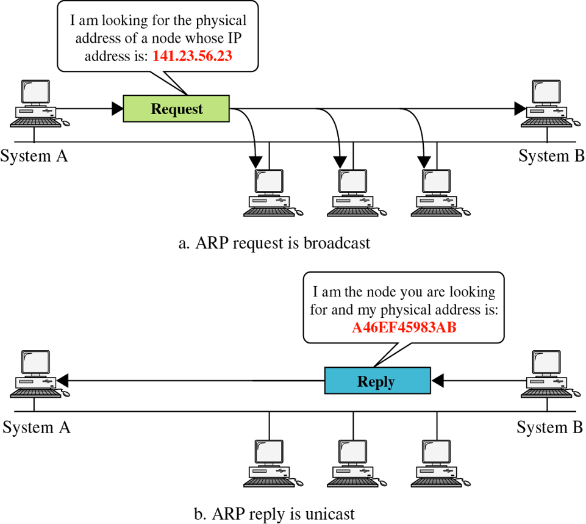
- Name mapping: IP address <-> MAC address

### 网络拓扑结构 (Network Topology) 
- Example: SJTU network
    - 子网(Subnet): usually like 192.168.0.2 or 10.0.0.2
    - 网关(Gateway): usually like 192.168.0.1
        - get the global IP address: 202.120.40.82
        - 网关往往有两个甚至多个 IP 地址
    - 代理(Proxy): get proxy's address
        - e.g. 106.185.46.164 (Japan)

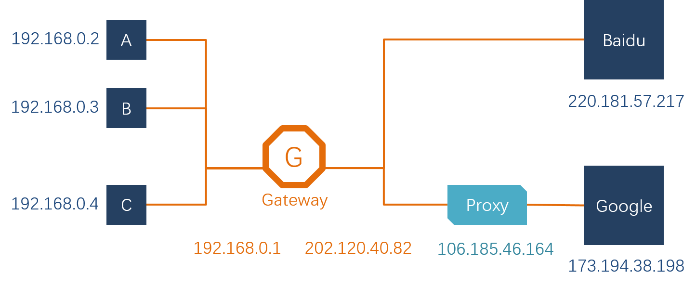

### 如何使用套接字(socket)访问 www.baidu.com

- 写代码的时候，类似于直接连接到 baidu 的
    - Call connect() with Baidu's IP address
- 但是系统如何找到下一个链路节点 (next hop) 

### Putting All Together
- App: 想要给 Baidu 发一个数据包. 数据包里是 百度的 IP （target IP），自己的 IP （source IP）

- OS: OS并不知道如何抵达 Baidu 这个网络节点。OS 会将数据包发送给 路由器（网关） (router(gateway)). 但是 OS 并不能改变 source IP， 所以 OS 仅仅把 Target MAC 改成路由器（网关）的 MAC 地址

- Router-1 (gateway): router-1 收到了一个 Target MAC 是自己 MAC 地址的数据包，但是 IP 地址并不是自己的。那么 router-1 就会把 Target MAC 改成下一个节点的 MAC 地址(NAT: 同时改变 source IP 和 source port)，最后把数据包发向下一个节点(next hop)

- Router-2: 如果 Router-2 能够访问到 Baidu，那么将 Target MAC 改为 Baidu 的


### ARP Spoofing

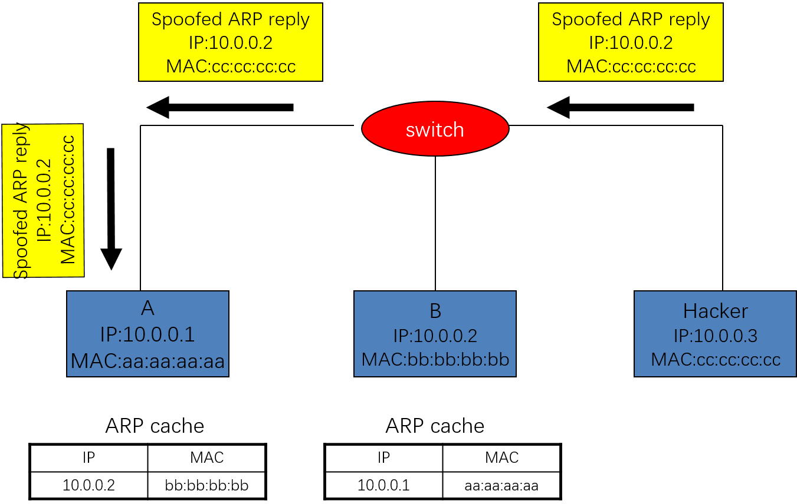


- 然后如果 A 想给 B 发包，那么全都会发到 Hacker 的机器上。
- Cache entry 会过期，因此需要再次发送 ARP 来更新 Cache
    - How often ? depends on the particular system
    - usually every 40s 
- 如果 Hacker 不希望他的 Ethernet driver 一直在运行
    - 用 ifconfig -arp 实现

### 中间人攻击 Man-in-the-Middle Attack
- Hacker 将他的节点插入到两个通信节点之间
- 在同一个交换机子网下，中间人攻击利用 ARP Spoofing 进行:
    - Suppose X is the hacker's computer
    - T1 and T2 are the targets
    - X poisons the ARP cache of T1 and T2
    - T1 associates T2's IP with X's MAC
    - T2 associates T1's IP with X's MAC
    - All of T1 and T2's traffic will then go to X first, instead of directly to each other


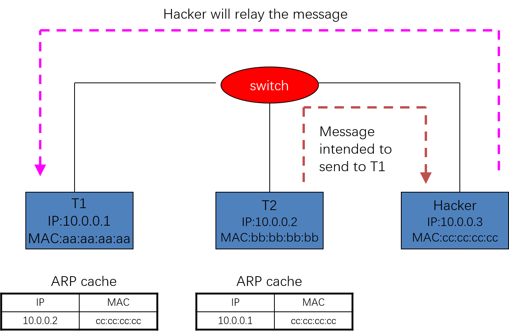

### 防御 ARP Spoofing
- No universal defense
- 使用静态的 ARP entries
    - 不能被更新
    - Spoofed ARP replies are ignored
    - ARP table needs a static entry for each machine on the network
    - Large overhead
        - Deploying these tables
        - Keep the table up-to-date

### Arpwatch
- 用来监听网络上 ARP replies 的免费 UNIX 程序
- 它会建立 IP/MAC 的表，并存在文件里
- 当某个 IP/MAC 改变(flip-flop)时，自动给网管发邮件提醒
- 但是这并不能完全解决问题，比如 Ettercap 这种攻击方式，它只会引起一些 flip-flop，在 DHCP-enabled network 中 flip-flop 会频繁发生，因此很难被发现

# lec 18
Best-effort is not enough


## 端到端层(End-to-End Layer)

### 端到端层
- 网络层并没有保证
    - Delay
    - Certainty of arrival
    - Right place to deliver
    - Order of arrival
    - Accuracy of content
- 端到端层
    - 没有一个设计是能够满足上述全部要求的
    - 每个协议都为一种应用设计
    - Example
        - UDP (User Datagram Protocol)
            - 在一些简单应用中被直接使用
            - 也被使用于其他协议中
        - TCP (Transimission Control Protocol)
            - 保证顺序，没有丢失，没有冗余
            - Provision for flow control
        - RTP (Real-time Transport Protocol)
            - Built on UDP
            - 使用于流式数据如视频、音频
        - 没有一个能够满足所有应用场景

### Assurance of End-to-end Protocol
- At-least-once delivery
- At-most-once delivery
- Data Integrity
- Stream order & closing of connections
- Jitter control （网络波动控制？）
- Authenticity and privacy
- End-to-end performance

### At-least-once delivery
- RTT (Round-trip time) 往返时间
    - to_time + process_time + back_time(ack)
- At least once on best effort network
    - 发数据包时，连带发一个 nonce （类似于一个随机数）
    - 发送者保留 packet 的一份拷贝
    - 如果在收到 ACK 之前超时了，就重发
    - 接收者回复一个 ACK 以及 nonce
- 在接收者返回 error 之前，重发有限次
- Dilemma
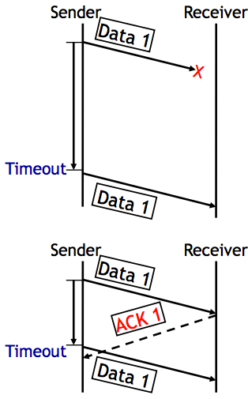
    - 1. 接收者没有收到数据包
    - 2. 接收者收到数据包，但是发送者没有收到 ACK
    - 没有方式能够知道究竟是 1 还是 2
#### 如何决定超时时间
- Fixed Timer 
- Adaptive Timer
- NAK(Negative Acknowledgment)

##### Fixed Timer
- Dilemma
    - Too short: 引起不必要的重传
    - Too long: 发现丢包所需要的时间过长
- Problem
    - NFS 中，固定时间会导致 congestion collapse （拥塞崩溃）
    - Emergent phase synchronization of periodic protocols
        - 周期性轮询 (Periodic polling)
            -  比如发个邮件，"are-you-there"
            - 某个 workstation 会每 5min 广播一次数据包
            - 所有的 workstation 都是在同一时间尝试广播
        - Each workstation
            - Send a broadcast
            - Set a fixed timer
        - Lesson: Fixed timers have many evils. Do not assume that unsynchronized periodic activities will stay that way

    - Wisconsin time server meltdown
        - NETGEAR 为无线路由器添加了一个 feature
            - Logging packets -> timestamp -> time server (SNTP) -> name discovery -> 128.105.39.11
            - Once per second (!) until receive a response
            - Once per minute or per day after that
        - Wisconsin Univ.
            - From 20,000 to 60,000 requests per second, filtering 23457
            - After one week, 270,000 requests per second, 150Mbps
        - Lesson(s)
            - Fixed timers, again
            - Fixed Internet address
            - The client implements only part of a protocol
                - There is a reason for features likes the "go away" response in SNTP

##### Adaptive Timer
- Example 
    - 根据 RTT 调整 
    - Exponential back-off
- 但是 RTT 变化很大
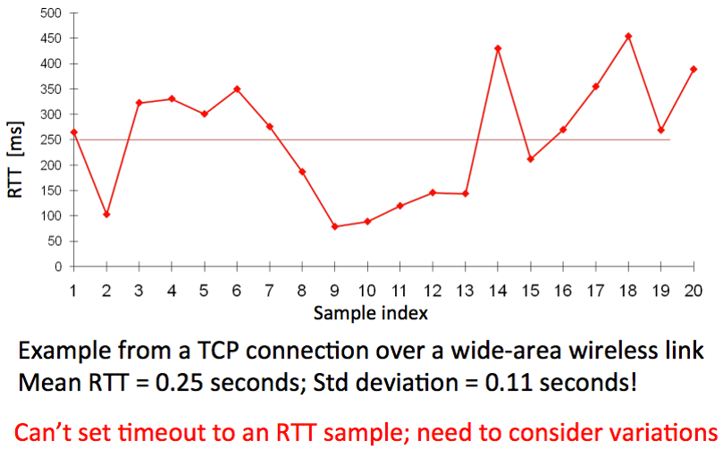

- 计算 RTT 和 Timeout (in TCP)
- Exponentially weighted moving average
    - 估计均值 `rtt_avg` 和方差 `rtt_dev`
    ```C
    Procedure calc_rtt(rtt_sample)
        rtt_avg = a*rtt_sample + (1-a)*rtt_avg; /* a = 1/8 */  
        dev = absolute(rtt_sample – rtt_avg); 
        rtt_dev = b*dev + (1-b)*rtt_dev;  /* b = 1/4 */  

    Procedure calc_timeout(rtt_avg, rtt_dev)
        Timeout = rtt_avg + 4*rtt_dev
    ```

##### NAK(Negative AcKnowledgement)
- 接收者向发送者发一个信息，列出缺少的数据包
- 接收者对收到的数据包计数，而不是计时
- 发送者不需要维护 timer(only once per stream)

### At-most-once Delivery
- At-least-once 
    - 发送者端记录状态
    - 容易产生多余的请求
- At-most-once
    - 接收端维护一个 nonce table
    - 表格可能会无限增长
        - 空间以及搜索时间
        - Tombstones (something that cannot be deleted forever)
    - 另一个方式：让 app 允许多余的请求
        - 回顾 NFS 的崩溃情况：Server 浪费时间在处理多余的请求

#### 减少冗多于请求 Duplicate Suppression
- 单调递增的 sequence number
    - 接收端丢弃较小 nonce 的请求，保留最后一个 nonce，one per sender (tombstone)
- 接受出错的可能性
    - E.g., if sender always gives up after five RTT (cannot ensure at-least-once), then receiver can safely discard nonces that are older than five RTT
    - It is possible that a packet finally shows up after long delay (solution: wait long time)
- 如果接收者崩溃重启了：会丢失 nonce table
    - One solution:每次重启使用新的 port number
    - Another: ignore all packets until the number of RTT has passed since restarting, if sender tries limit times

- 总之，duplicate suppresion 会引入复杂度

### Data Integrity
- 定义：接收者能够得到与发送者一样的数据内容
- 可靠的发送协议
    - 发送者：加一个 checksum
    - 接收者：重新计算 checksum，不匹配就丢弃
- Q: Is it redundant since link layer provides checksum?
    - 链路层保证传输不会出错，这里可以保证其他地方不会出错, e.g., in memory copying
- 这个保证不是绝对的
    - What if a packet is mis-delivered and the receiver ACK?

### Segments and Reassembly of Long Messages
- Bridge the difference between message and MTU
    - 消息长度：由应用决定
    - MTU(最大传输单元)：由网络决定
- Segment contains ID for where it fits
    - E.g., "message 914, segment 3 of 7"
    - Can be used for at-least-once and at-most-once delivery
- Reassembly
    - Out-of-order, mingled with other message's segments
    - Allocating a buffer large enough to hold the message
    - Keeping a checklist for segments not arrived
- 当乱序的时候(Out-of-order)
    - Solution-1：只接受符合顺序的 ACK
        - 浪费带宽
    - Solution-2：ACK every packet，只在buffer里存较早的buffer，当数据组装完毕后释放buffer
        - 如果有bad packet，需要使用一个很大的buffer
    - Solution-3：结合前两者
        - 当 buffer 满了就丢弃
        - 新的问题：多大的buffer？
    - Speedup for common case
        - NAK 避免超时
        - 如果 NAKs 导致 duplicates，停止 NAKs
    - TCP 基于 ACK 而非 NAK

### Closing of Connections
- Open a stream
    - 记录哪个 elements 被发出、收到、ack
- Close a stream
    - 结束时，report an end-of-stream
    - Both ends need to agree last elements is OK and then close
    - 1. Alice sends close request to Bob with stream record ID
    - 2. Bob checks and agrees, sends a close ACK
    - 3. Alice receives ACK, turn off sender, discard record
    - 4. Alice sends "all done" to Bob
    - 5. Bob receives "all done" and discard stream record

### Jitter Control
- Real-time
    - 当时效性比可靠性更重要时
    - 比如视频中有几个像素点出错，其实并不重要
    - Jitter：传输时的变化，网络中的波动
- Strategy
    - Basic：delay all arriving segments
    - 比如视频传输的 HLS 协议。播放10s前收到的视频，就有缓冲时间
- 需要测量网络延迟的分布
- 决定 D_long 让它比 99% 的网络延迟更长
- 决定最短的延迟 D_short
- 计算 number of segment buffer 
    - n = (D_long - D_short)/D_headway
    - D_headway 是每个 arriving segments 的平均 delay

### Authenticity and Privacy
- Key-based 数学转换方式
    - Sign and verify：establish the authenticity of the source and integrity of contents
    - Encrypt and decrypt: maintain privacy of contents
- Consideration
    - False sense of security, worse than no assurance
    - 你以为安全，比不做任何安全措施还要危险

- Security：非对称加密
    - Public key: encrypt to identify reader (only me can read this)
    - Private key: encrypt to identify writer (yes, it's me who wrote this)
    - 性能不好，所以还是用对称加密

### End-to-end Performance


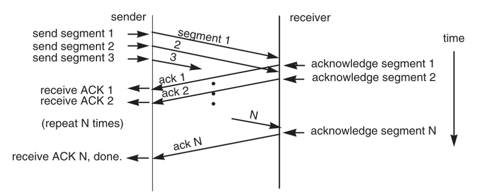
- Packets or ACK 可能会丢失
    - 发送者持有一个已发送的 segments 的列表，当收到 ACK 时 check it off
    - According to RTT, set timer for last segment
- If list of missing ACK is empty, OK
- If timer expires, resend packets and another timer

#### Fixed Window

- Receiver tells the sender a window size
- Sender sends window
- Receiver acks each packet as before
- Window advances when all packets in previous window are acked
    - E.g., packets 4-6 sent, after 1-3 ack done
- If a packet times out -> resend packets
- Still much idle time

#### Sliding Window
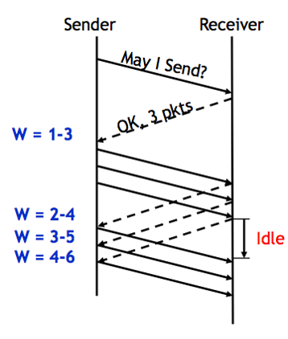
- Sender advances the window by 1 for each in-sequence ACK it receives
    - Reduces idle periods
    - Pipelining idea
- But what's the correct value for the window?
    - We'll revisit this question
    - First, we need to understand windows
- 处理丢包


- Recovery
    - When to take action on sender's checklist?
        - Solution-1: Timestamp and timeout
            - Associate each segment in the list with a timestamp
            - After more than one RTT, resend
        - Solution-2: Numbering segments
            - Receiver sends a NAK
- If sender resends a segment, should the available window increase?
    - Presume receiver discard duplicated segments
    - no increase
- What if a permission message is lost?
    - No data will be received
- Resend permission message?
    - May get twice as much
    - Incremental value is fragile -> cumulative total is better
        - E.g., using "send 1-3" instead of "send 3 more"
    - Similar with "in" and "out" pointer in bounded-buffer
- Rate-matching problem
    - Blizzard of packets arising from a newly-opened window
    - Need cooperation between end-to-end protocol & network forwarders

##### 如何选择合适的 window size
- too small
    - 很长的空闲时间
    - underutilized network
- too large
    - congestion
```
window size >= round-trip time * bottleneck data rate
```
- Larger window makes no sense
- Data rate is still bottleneck
- Example
    - Receive 500 KBps
    - Sender 1 MBps
    - RTT 70ms
    - A segment carries 0.5 KB
    - then: Sliding window size = 35KB (70 segment)

## Congestion Control
- 主要是网络层与端到端层负责处理拥塞
- 网络层
    - 直接经历拥塞
    - 最终决定面临过量数据包该怎么做
- 端到端层
    - 控制发送的频率，最有效的方式


- If all of a sudden, streams of packets begin arriving on three or four input lines and all need the same output line, a queue will build up
- 虽然更多的内存能够缓解，但是 Nagle(1987) 证实如果内存无限大，其实拥塞会更严重
- 因为很多到队首的 packets 很可能已经过期，仍需要重发

### Load Shedding: Setting window size
- For performance
    - window size ≥ round-trip time × bottleneck data rate
- For congestion control
    - window size ≤ min(RTT x bottleneck data rate, Receiver buffer)
    - Congestion window

### Congestion Control
- Basic idea:
    - Increase congestion window slowly
    - If no drops -> no congestion yet
    - If a drop occurs -> decrease congestion window quickly
- Use the idea in a distributed protocol that achieves
    - Efficiency: i.e., uses the bottleneck capacity efficiently
    - Fairness, i.e., senders sharing a bottleneck get equal throughput (if they have demands)
### AIMD (Additive Increase, Multiplicative Decrease)
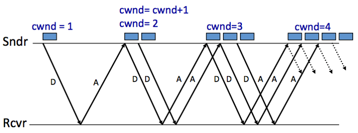
- Every RTT:
    - No drop: cwnd = cwnd + 1
    - A drop: cwnd = cwnd / 2
- Problem
    - Increases very slowly at the beginning 
    - Initial window size is 1
        - Probably too small in practice
- Solution
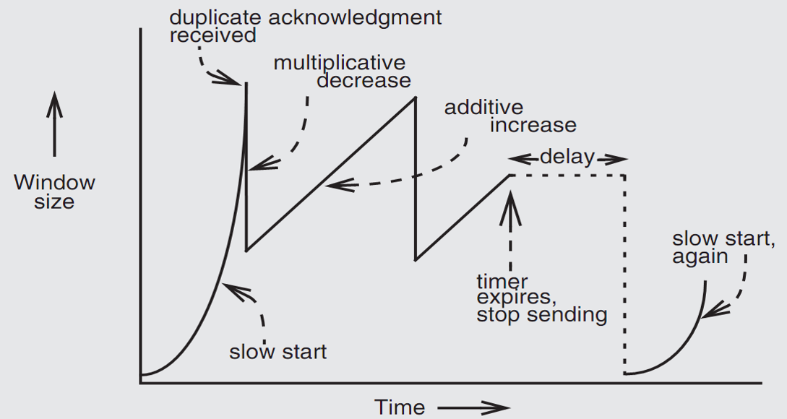
    - do multiplicative increase at the beginning
        - Congestion_window init = 1
        - Initially, do Congestion_window ← 2 * Congestion_window each RTT until we hit congestion
        - Named "slow start" (even though it's exponentially fast!) 
    - TCP 并不知道 duplicate 是 lost segment 还是 reordering of segments，因此收到一些 duplicate ACKs 时，window size 才减小


1. Slow start: one packet at first, then double until
Sender reaches the window size suggested by the receiver 
All the available data has been dispatched
Sender detects that a packet it sent has been discarded
2. Duplicate ACK
When receiver gets an out-of-order packet, it sends back a duplicate of latest ACK
3. Equilibrium(平衡)
Additive increase & multiplicative decrease
4. Restart, after waiting a short time

- AIMD leads to both efficiency and fairness
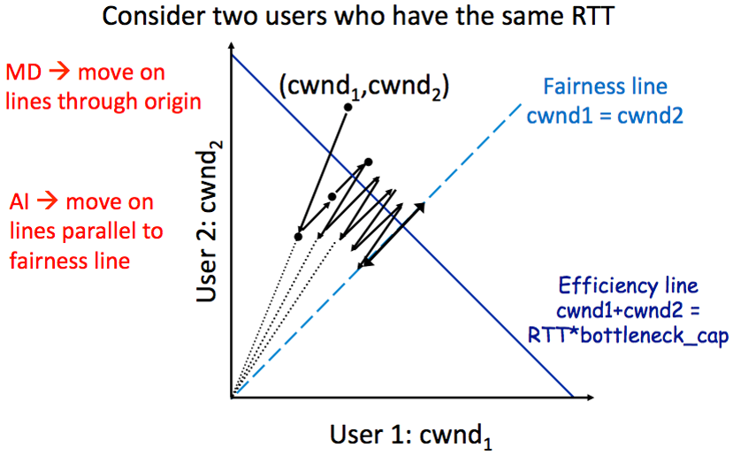
    - cwnd 指拥塞窗口 congestion window
- Q: Why not additive decrease
    - A: from a congested point, (x',y'), reducing each by 1 worsens fairness and takes us away from the "ideal" outcome

### Weakness of TCP
- If routers have too much buffering, causes long delays
- 丢包并不完全是拥塞导致的
    - 比如无线网络。重试更有效
- TCP 在数据中心性能并不好
    - 高带宽，低延迟的情况
- TCP 对于 long RTTs 不友好
    - throughput 与 RTT 成负相关
    - 很远的地方
        - 即使没丢包，也容易超时
    - 很近的地方
        - 偶尔丢包，窗口一砍，网速腰斩
- Assumes cooperating sources, which is not always a good assumption（客户端可能是恶意的，比如流氓TCP，你腰斩，我翻倍，不要怂，就是干）

### Summary of Congestion Window
- Reliability Using Sliding Window
    - Tx Rate = W / RTT （写入速率等于窗口大小 / round-trip time）
- Congestion Control
    - W = min(Receiver_buffer, cwnd)
    - Congestion window is adapted by the congestion control protocol to ensure efficiency and fairness
    - TCP congestion control uses AIMD which provides fairness and efficiency in a distributed way
